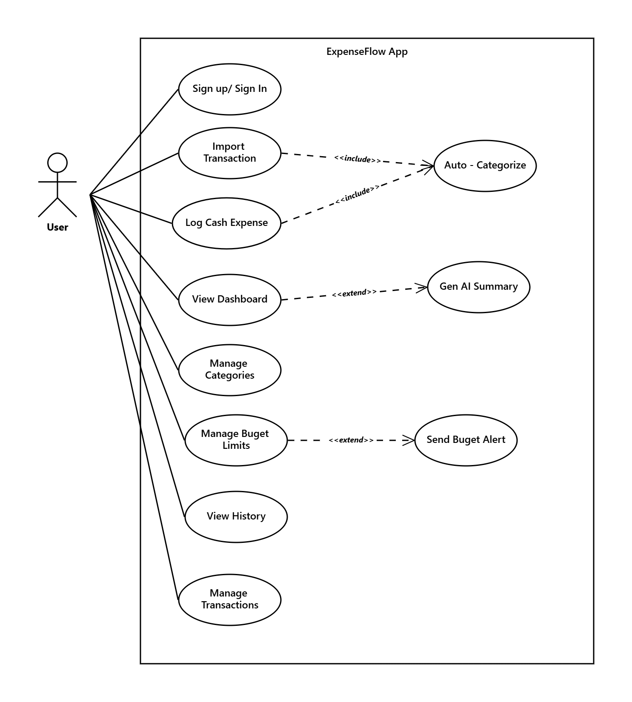

# Service Overview

## Architecture diagrams

## Services

| Service                                           | Port | Stack                 |
| ------------------------------------------------- | ---- | --------------------- |
| [Auth Service](./auth.md)                         | 3000 | Node.js / Better Auth |
| [Transaction Service](./transaction-service.md)   | 8080 | Spring Boot / Java    |
| [Budget Service](./budget-service.md)             | 8082 | Spring Boot / Java    |
| [Notification Service](./notification-service.md) | 8081 | Spring Boot / Java    |
| [GenAI Service](./genai-service.md)               | 8000 | FastAPI / Python      |
