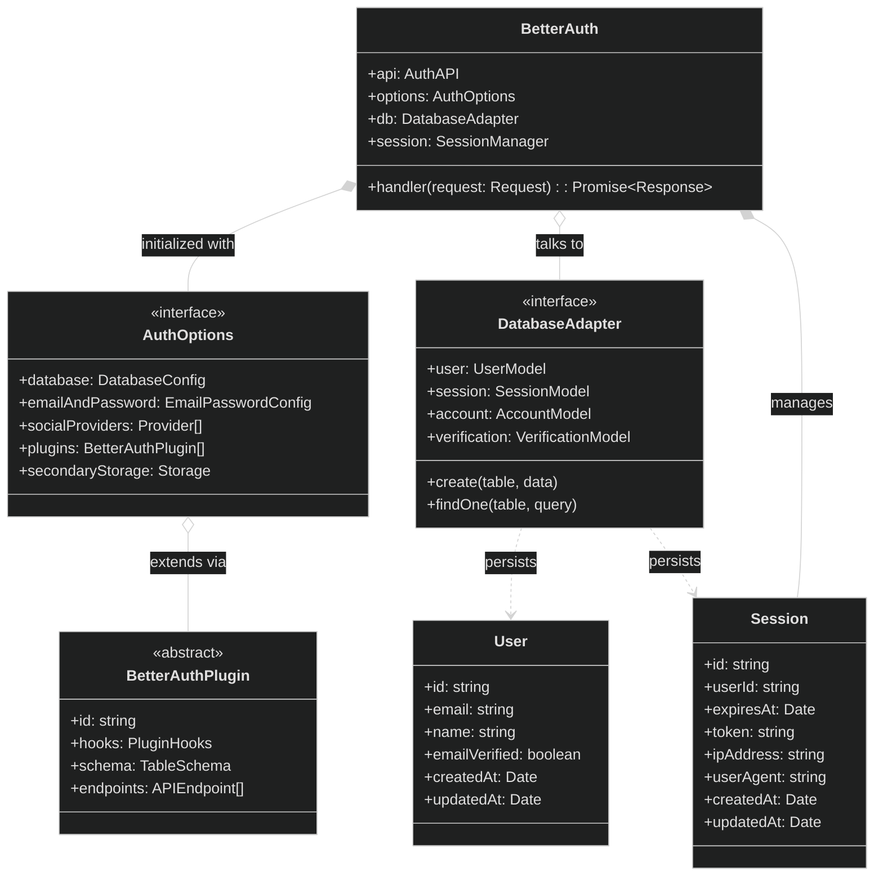
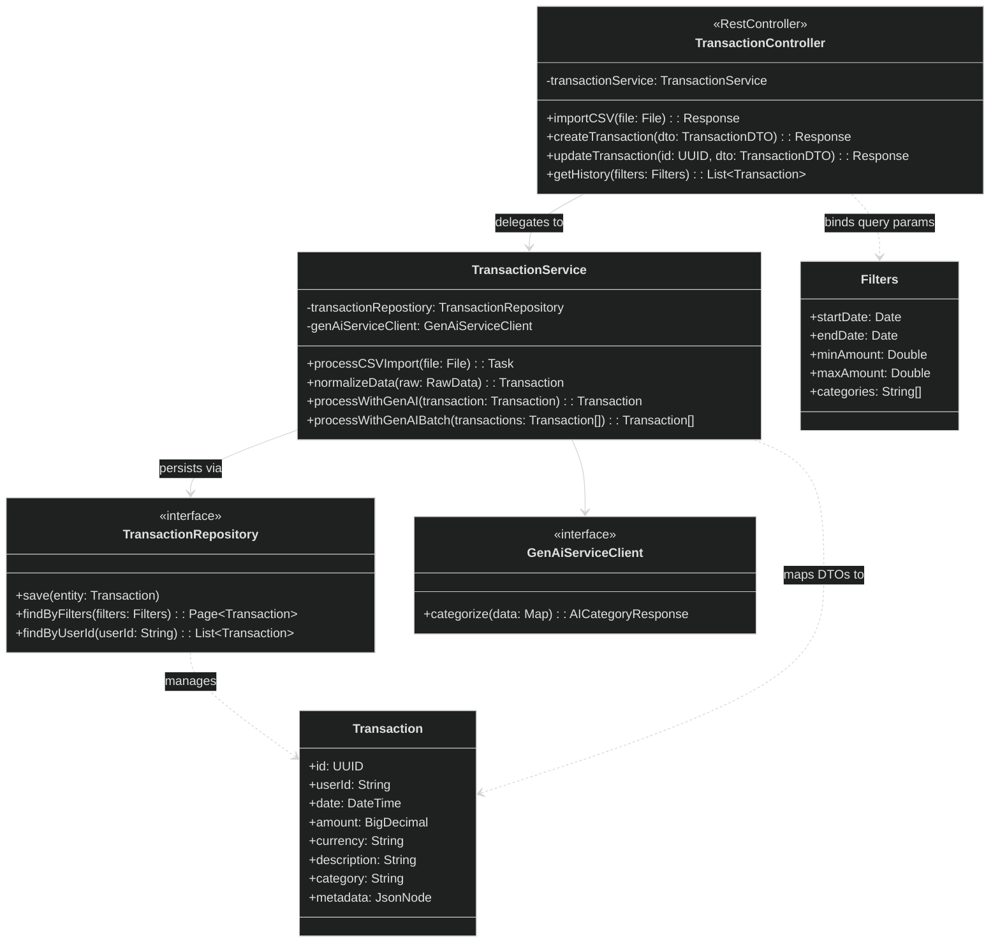
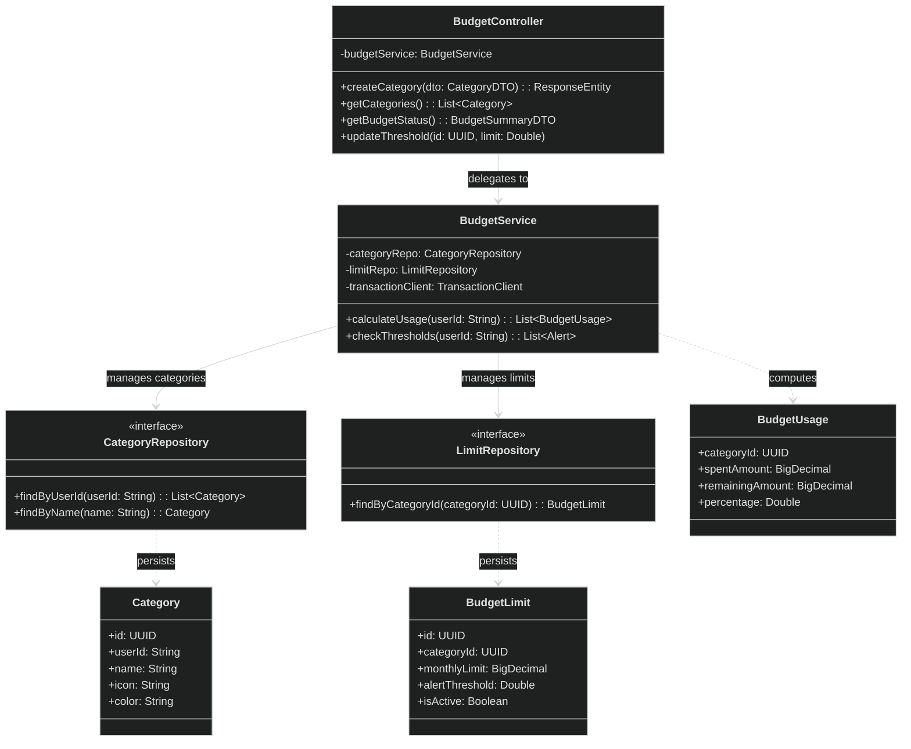
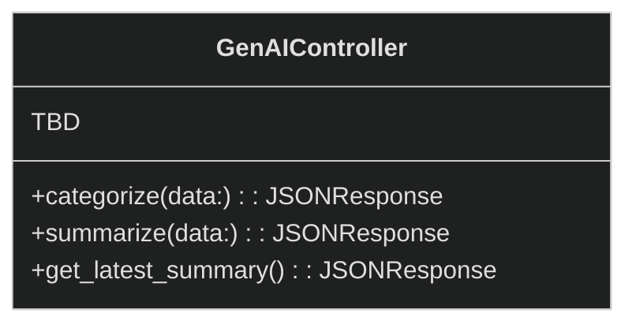

# ⚡ ExpenseFlow `by 99 Downtime`

---

## Component Diagram


---

### 1. Auth Service

**Responsibility:**  
Handles authentication and identity (Better Auth), including user sign-in/sign-up flows, and issuing JWTs for token-based auth used by the other microservices.

**Flow:**  
Client signs in via AuthService → client retrieves a JWT (`/api/auth/token`) → client calls other services with `Authorization: Bearer <jwt>` → services validate tokens via JWKS (`/api/auth/jwks`).

**Features:**

- Email + password authentication
- (optionally) Social OAuth providers
- Session management (get session / sign out)
- Email verification
- Password reset + password change

**Client Usage (React):**

Create a Better Auth client in the React app

```ts
// apps/client/src/lib/auth-client.ts
import { createAuthClient } from "better-auth/react";
import { jwtClient } from "better-auth/client/plugins";

export const authClient = createAuthClient({
  plugins: [jwtClient()],
});
```

**JWT + JWKS for Microservices (Token-Based Auth):**

Other microservices can’t rely on browser session cookies, so they authenticate requests using a **JWT** issued by AuthService.

- The client retrieves a JWT via the JWT plugin:

```ts
const { data } = await authClient.token();
const jwt = data?.token;
```

- The client includes it on cross-service calls:

```ts
await fetch("/api/transactions", {
  headers: {
    Authorization: `Bearer ${jwt}`,
  },
});
```

- Each service validates tokens using AuthService’s **JWKS** endpoint (`GET /api/auth/jwks`) and caches keys. On `kid` mismatch, refresh JWKS. Spring can achieve this with the following `application.yml` entry:

```yml
spring:
  security:
    oauth2:
      resourceserver:
        jwt:
          # The URL of auth service
          jwk-set-uri: http://auth-service:3000/api/auth/jwks
          issuer-uri: http://auth-service:3000
```



---

### 2. Transaction Service

**Responsibility:**  
Handles transaction import, normalization, storage, and transaction history management.

**Flow:**  
Import CSV/text → send to AI Service for categorization → store transactions → expose history and filters.

**Features:**

- Bank CSV imports
- Free-text expense parsing
- Transaction history
- Filtering and manual edits

**API:**

| Method | Endpoint                   | Purpose                                        |
| ------ | -------------------------- | ---------------------------------------------- |
| POST   | `/api/transactions/import` | Import transactions from CSV/text              |
| POST   | `/api/transactions`        | Create a transaction                           |
| GET    | `/api/transactions`        | List transaction history (optionally filtered) |
| GET    | `/api/transactions/{id}`   | Get a single transaction by id                 |
| PATCH  | `/api/transactions/{id}`   | Update a transaction                           |
| DELETE | `/api/transactions/{id}`   | Delete a transaction                           |



---

### 3. Budget Service

**Responsibility:**  
Manages categories, spending limits, and budget monitoring.

**Flow:**  
User creates categories → transactions are aggregated per category → budget usage is calculated → alerts are triggered at thresholds.

**Features:**

- Budget tracking
- Threshold alerts (80% / 100%)
- Spend analytics per category

**API:**

| Method | Endpoint               | Purpose                         |
| ------ | ---------------------- | ------------------------------- |
| POST   | `/api/categories`      | Create a category               |
| GET    | `/api/categories`      | List categories                 |
| PUT    | `/api/categories/{id}` | Update a category               |
| DELETE | `/api/categories/{id}` | Delete a category               |
| GET    | `/api/budgets/status`  | Get budget usage/status summary |



---

### 4. Notification Service (or different service?)

**Responsibility:**  
Sends out notifications when budget limits are reached.

**TBD**

---

### 5. AI Service

**Responsibility:**  
Handles transaction categorization and financial summaries using LLM pipelines.

**Flow:**  
Receive transaction data → classify/summarize → return structured output.

**Features:**

- Transaction categorization
- Free-text parsing
- Weekly summaries
- User correction feedback loop

**API:**

| Method | Endpoint                   | Purpose                                      |
| ------ | -------------------------- | -------------------------------------------- |
| POST   | `/api/ai/categorize`       | Categorize a transaction / free-text expense |
| POST   | `/api/ai/summarize`        | Generate a financial summary                 |
| GET    | `/api/ai/summarize/latest` | Fetch the latest summary                     |



---
