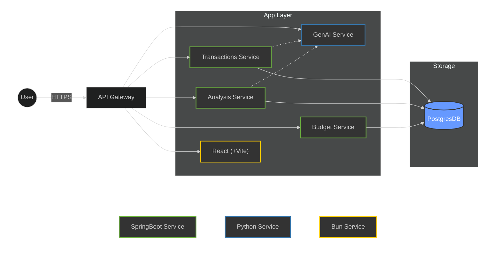

# ⚡ ExpenseFlow `by 99 Downtime`

---

# Service Overview

```mermaid
---
displayMode: compact
config:
  theme: dark
---
graph TD
    %% Define Styles

    classDef service fill:#f9f,stroke:#333,stroke-width:2px;
    classDef database fill:#69f,stroke:#333,stroke-width:2px,color:#fff;
    classDef springService fill:#333,stroke:#6db33f,stroke-width:2px;
    classDef pythonService fill:#333,stroke:#3776ab,stroke-width:2px;
    classDef bunService fill:#333,stroke:#ffcc00,stroke-width:2px;

    subgraph System_Architecture [<span></span>]
      direction LR

      User((User)) -->|HTTPS| Gateway

      Gateway[API Gateway] --> ReactS & GenAiS & TransactionS & BudgetS & AnalysisS


      subgraph Private_Subnet [App Layer]
          GenAiS[GenAI Service]

          TransactionS[Transactions Service] -.-> GenAiS

          AnalysisS[Analysis Service] -.-> GenAiS

          BudgetS[Budget Service]
          ReactS["React (+Vite)"]


      end

      subgraph Data_Layer [Storage]

          TransactionS --> DB1[(PostgresDB)]

          AnalysisS --> DB1[(PostgresDB)]

          BudgetS --> DB1[(PostgresDB)]

      end

      Private_Subnet ~~~~ Data_Layer

      %% Apply Styles
      class User largeIcon;
      class TransactionS,AnalysisS,BudgetS springService;
      class GenAiS pythonService;
      class ReactS bunService;
      class DB1,DB2 database;
    end


    subgraph Legend [<span></span>]
      direction LR
      Spring[SpringBoot Service]
      class Spring springService;

      Python[Python Service ]
      class Python pythonService;

      Bun[Bun Service ]
      class Bun bunService;

      Spring ~~~ Python ~~~ Bun
    end

    System_Architecture ~~~ Legend

    style Legend fill:#fff1,stroke:none,padding:2px,margin:2px;
    style System_Architecture fill:none,stroke:none,stroke-width:1px,padding:10px;
```
