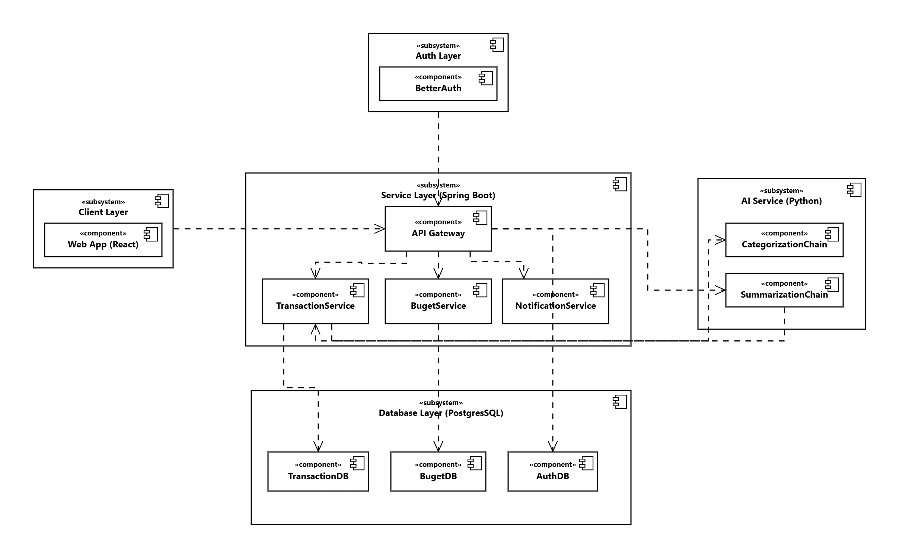

# Service Overview

## Services

| Service                                                    | Port | Stack                 |
| ---------------------------------------------------------- | ---- | --------------------- |
| [Auth Service](./services/auth.md)                         | 3000 | Node.js / Better Auth |
| [Transaction Service](./services/transaction-service.md)   | 8080 | Spring Boot / Java    |
| [Budget Service](./services/budget-service.md)             | 8082 | Spring Boot / Java    |
| [Notification Service](./services/notification-service.md) | 8081 | Spring Boot / Java    |
| [GenAI Service](./services/genai-service.md)               | 8000 | FastAPI / Python      |

---

## Architecture diagrams

