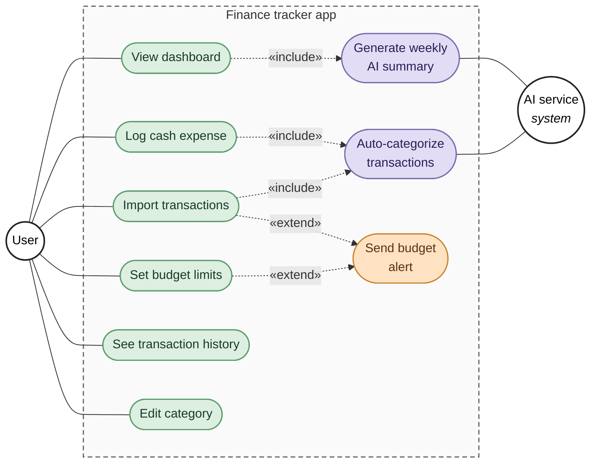

```mermaid
flowchart LR
    %% ===== Actors =====
    User((User))
    AIService(("AI service<br/><i>system</i>"))

    %% ===== System boundary =====
    subgraph App["Finance tracker app"]
        direction TB

        %% --- User actions (green) ---
        UC1(["Import transactions"]):::userAction
        UC2(["Log cash expense"]):::userAction
        UC3(["View dashboard"]):::userAction
        UC4(["Set budget limits"]):::userAction
        UC5(["See transaction history"]):::userAction
        UC6(["Edit category"]):::userAction

        %% --- AI / system (purple) ---
        UC9(["Auto-categorize<br/>transactions"]):::aiSystem
        UC10(["Generate weekly<br/>AI summary"]):::aiSystem

        %% --- Alert (orange) ---
        UC11(["Send budget<br/>alert"]):::alert
    end

    %% ===== User associations =====
    User --- UC1
    User --- UC2
    User --- UC3
    User --- UC4
    User --- UC5
    User --- UC6

    %% ===== AI service associations =====
    UC9  --- AIService
    UC10 --- AIService

    %% ===== Include / Extend =====
    UC1 -. "&laquo;include&raquo;" .-> UC9
    UC2 -. "&laquo;include&raquo;" .-> UC9
    UC3 -. "&laquo;include&raquo;" .-> UC10
    UC4 -. "&laquo;extend&raquo;"  .-> UC11
    UC1 -. "&laquo;extend&raquo;"  .-> UC11

    %% ===== Styles =====
    classDef userAction fill:#dcefe0,stroke:#5a9c6e,stroke-width:1.5px,color:#1a3a25;
    classDef aiSystem   fill:#e3dcf5,stroke:#7b6cb0,stroke-width:1.5px,color:#2a1f55;
    classDef alert      fill:#ffe2c2,stroke:#cc8533,stroke-width:1.5px,color:#5a3210;
    classDef actor      fill:#ffffff,stroke:#222,stroke-width:2px,color:#000;

    class User,AIService actor;

    style App fill:#fafafa,stroke:#666,stroke-width:1.5px,stroke-dasharray:6 4;
```
