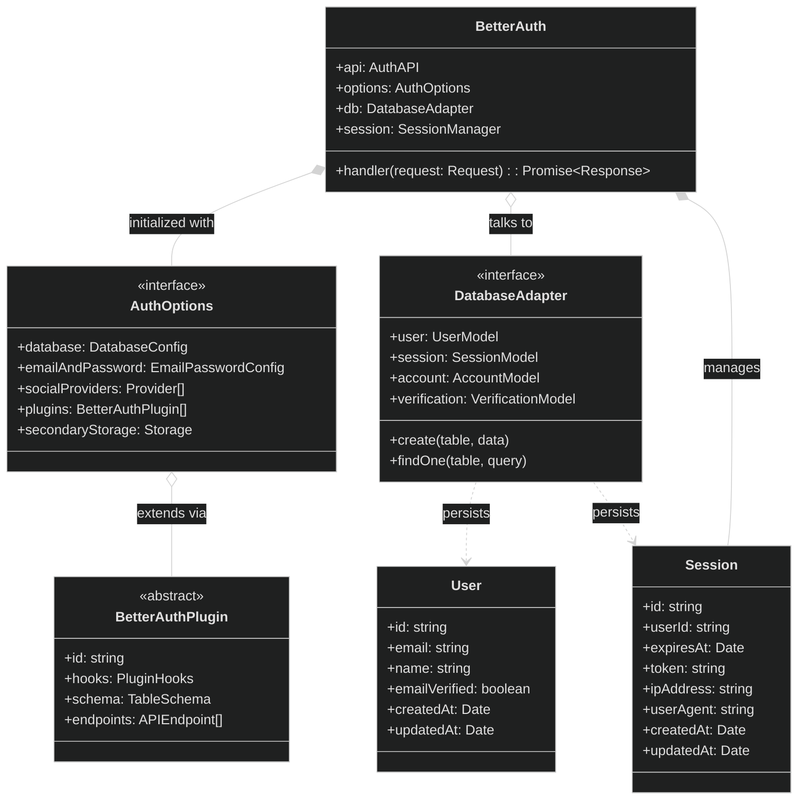

# Auth Service

**Responsibility:**
Handles authentication and identity (Better Auth), including user sign-in/sign-up flows, and issuing JWTs for token-based auth used by the other microservices.

**Flow:**
Client signs in via AuthService → client retrieves a JWT (`/api/auth/token`) → client calls other services with `Authorization: Bearer <jwt>` → services validate tokens via JWKS (`/api/auth/jwks`).

**Features:**

- Email + password authentication
- (optionally) Social OAuth providers
- Session management (get session / sign out)
- Email verification
- Password reset + password change

## Client usage (React)

Create a Better Auth client in the React app:

```ts
// apps/client/src/shared/lib/auth-client.ts
import { createAuthClient } from 'better-auth/react';
import { jwtClient } from 'better-auth/client/plugins';

export const authClient = createAuthClient({
  plugins: [jwtClient()],
});
```

## JWT + JWKS for microservices

Other microservices can't rely on browser session cookies, so they authenticate requests using a **JWT** issued by AuthService.

Retrieve a JWT via the JWT plugin:

```ts
const { data } = await authClient.token();
const jwt = data?.token;
```

Include it on cross-service calls:

```ts
await fetch('/api/transactions', {
  headers: {
    Authorization: `Bearer ${jwt}`,
  },
});
```

Each service validates tokens using AuthService's **JWKS** endpoint (`GET /api/auth/jwks`) and caches keys. On `kid` mismatch, refresh JWKS. Spring is configured with:

```yml
spring:
  security:
    oauth2:
      resourceserver:
        jwt:
          # JWKS is fetched server-to-server on the internal network. We use
          # jwk-set-uri (NOT issuer-uri): issuer-uri would trigger OIDC discovery
          # against the issuer origin (the browser-facing gateway), which isn't
          # reachable from inside the network.
          jwk-set-uri: ${AUTH_JWKS_URI:http://auth-service:3000/api/auth/jwks}
# The issuer claim ("iss") tokens must carry: the browser-facing gateway origin.
# Validated explicitly in SecurityConfig (see the JwtIssuerValidator).
auth:
  issuer: ${AUTH_ISSUER:http://localhost:9099}
```

## Class diagram


