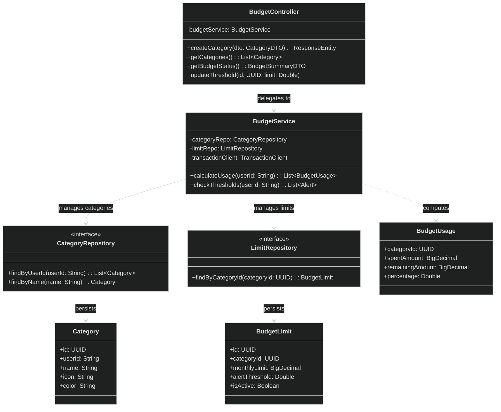

# Budget Service

**Responsibility:**
Manages categories, spending limits, and budget monitoring.

**Flow:**
User creates categories → transactions are aggregated per category → budget usage is calculated → alerts are triggered at thresholds.

**Features:**

- Budget tracking
- Threshold alerts (80% / 100%)
- Spend analytics per category

## API

| Method | Endpoint               | Purpose                         |
| ------ | ---------------------- | ------------------------------- |
| POST   | `/api/categories`      | Create a category               |
| GET    | `/api/categories`      | List categories                 |
| PUT    | `/api/categories/{id}` | Update a category               |
| DELETE | `/api/categories/{id}` | Delete a category               |
| GET    | `/api/budgets/status`  | Get budget usage/status summary |

## Class diagram

