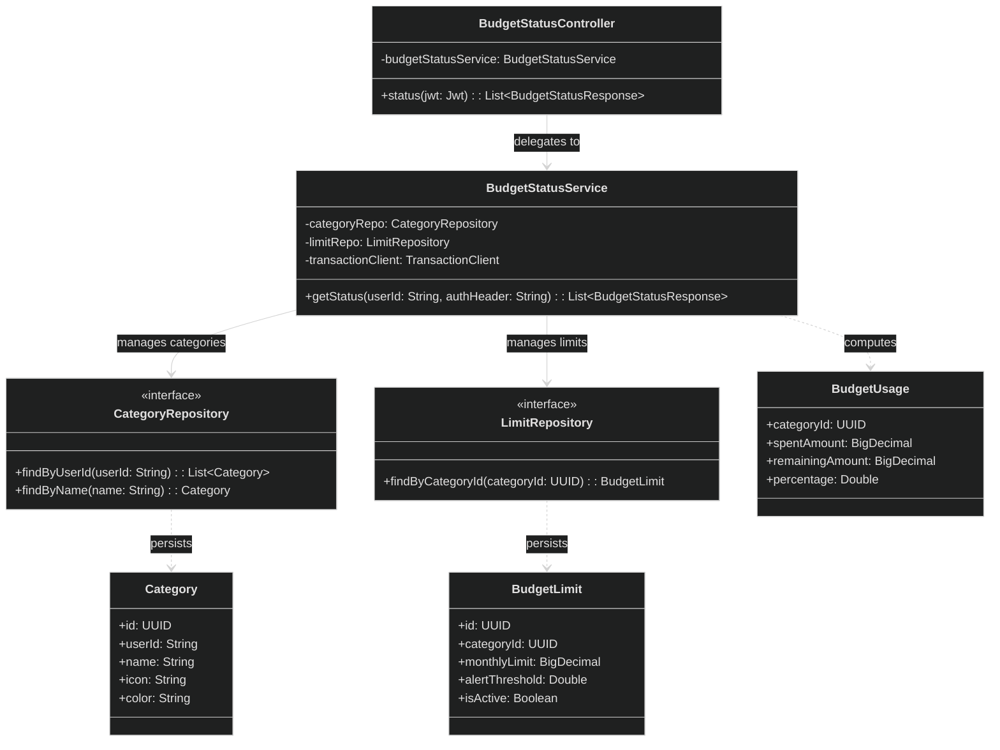

# Budget Service

**Responsibility:**
Manages categories, spending limits, and budget monitoring.

**Flow:**
User creates categories → transactions are aggregated per category → budget usage is calculated → alerts are triggered at thresholds.

**Features:**

- Budget tracking
- Threshold alerts (80% / 100%)
- Spend analytics per category

## API

| Method | Endpoint                       | Purpose                          |
| ------ | ------------------------------ | -------------------------------- |
| GET    | `/api/budgets/categories`      | List categories                  |
| POST   | `/api/budgets/categories`      | Create a category                |
| PATCH  | `/api/budgets/categories/{id}` | Update a category                |
| DELETE | `/api/budgets/categories/{id}` | Delete a category                |
| GET    | `/api/budgets/status`          | Get budget usage/status summary  |
| POST   | `/api/budgets/threshold-check` | Evaluate budget alert thresholds |
| GET    | `/api/budgets/me`              | Probe the authenticated user     |

## Class diagram

