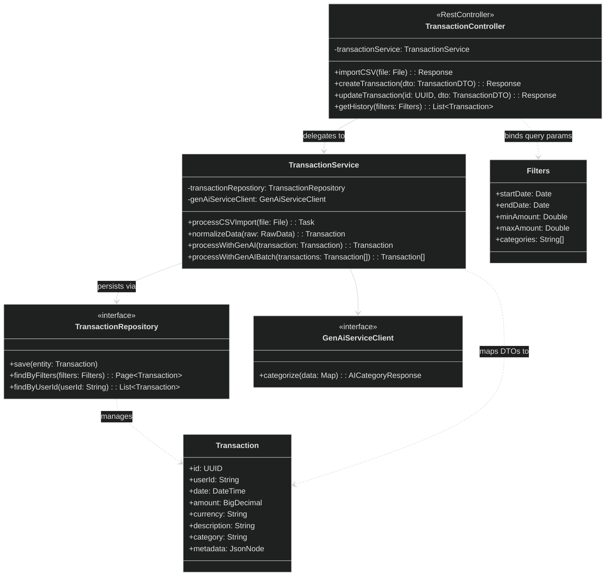

# Transaction Service

**Responsibility:**
Handles transaction import, normalization, storage, and transaction history management.

**Flow:**
Import CSV/text → send to AI Service for categorization → store transactions → expose history and filters.

**Features:**

- Bank CSV imports
- Free-text expense parsing
- Transaction history
- Filtering and manual edits

## API

| Method | Endpoint                   | Purpose                                        |
| ------ | -------------------------- | ---------------------------------------------- |
| POST   | `/api/transactions/import` | Import transactions from CSV/text              |
| POST   | `/api/transactions`        | Create a transaction                           |
| GET    | `/api/transactions`        | List transaction history (optionally filtered) |
| GET    | `/api/transactions/{id}`   | Get a single transaction by id                 |
| PATCH  | `/api/transactions/{id}`   | Update a transaction                           |
| DELETE | `/api/transactions/{id}`   | Delete a transaction                           |

## Class diagram

